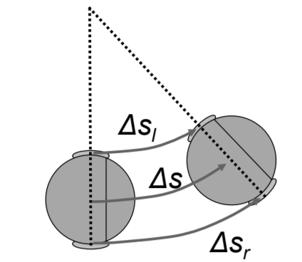
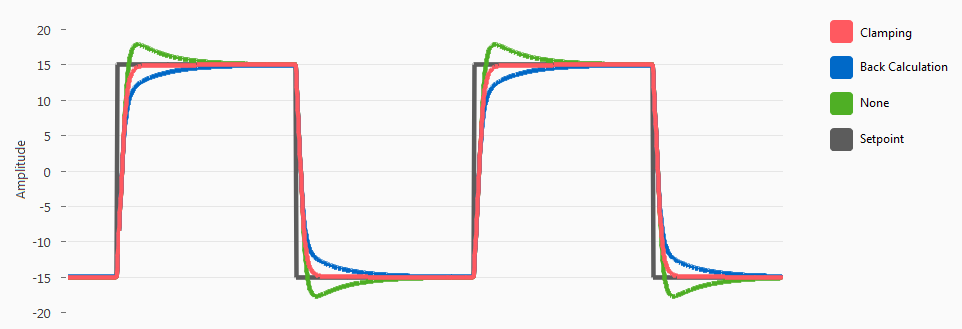
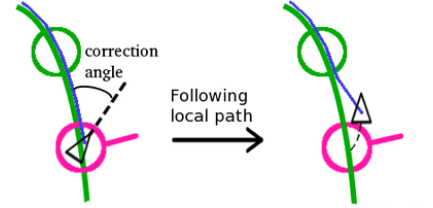
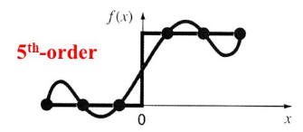

Motion Profiling, Tracking, and Pursuit via Odometry Theory on Differential Systems
====================================================================
## Application in Robotics 
---

Jake R. Johnson
---------------

## Abstract
This paper defines not only control theory for 4 wheel fixed-differential drivebases in VEX/FRC, but in any general application. Anywhere precise drivebase sensors are located, odometric measurements (absolute), velocity, and acceleration can be determined and used to construct movement profiles. Vision tracking and LIDAR are rigorous alternatives to Odometry, however they require more extensive tuning and difficult integration with motion profiles. Documented here is are most applicable and innovative processes for achieving desired movement in any system.

Many of these implementations were over the course of program development in team 6627A, during my time as head programmer and captain. 

---
## Odometry
Odometry theory is more generally defined as high-level position tracking
> Basic implementation, relative to start pos. (0,0)
> - Field-relative rather than bot-relative, reducing accumulated errors. To increase precision, it is best to minimize precise stops and merge movements together (discussed later as `pure pursuit control`) and follow paths

Model is defined as: <br>
Movement from:  <br>
Odometry telemetry:  (absolute at time )

### Modeling Motion
(1) Change in average radius, in terms of inner and outer radius, is used to calculate change in center of 4 wheel system<br>

<p align="center"></p>  

<br>

<p align="center"></p>

<br>
(2) Change in theta moving direction as a function of change in inner radius, represents clear advantage over gyroscopic sensors in taking absolute theta<br>


<p align="center"></p> 

<br>

<p align="center"></p>

 

These values can be used to create a vector representing absolute position difference (delta x, delta y, delta theta) between last state (assuming non-steady state)

<p align="center"></p> <br>

<p align="center"></p> <br>

<br>

<p align="center"></p> <br>

<p align="center"></p>

<br>

<p align="center"></p>
<p align="center"></p>


---

## Interactive Feedback PID Loops
Interactivity depends on derivative constant  as well as the dependence between proportional, integral and derivative modes. Parallel (non-interactive) controllers, are mostly unused. PID controllers are given by the alg.: 

<p align="center"></p> 
<br>

<p align="center"></p>

### **PIDF**: PID under a closed loop feedback control. Uses basic concept of setpoint, error, and target to generate clamped output, applied to system to reach target. 
- Error `e` multipled by proportional constant `K_p`, rendering output proportional to error
- Error is integrated over period `Δt`, then multipled by constant `K_i`. Renders the output on accumulation of past errors
-  of error `e` (calculated as `prevError - error`) normalized over update frequency (e.g. `Δdt = 10hz`) then multiplied by derivative constant `K_d`. Renders output on basis of error rate of change
- Finally, feed-forward determines relative "push force" to reach setpoint. Calculated by multiplying setpoint by constant `K_f`. Used less in PI/PID loops, more in motion-profiling velocity loops to determine initial output


## Integral Windup
Situation in PID loop where a large change in setpoint offests large rise (windup) in integral term `i`
- Rather than post-processing integral output, windup regulates output in real time


**Figure 1.0** Comparison of anti-windup strategies and setpointing

#### Clamping
Also known as conditional integration, uses technique to clamp range of integral output from accumulating in wrong direction during output saturation. <br>
**process saturation**: situation in which PI controller becomes non-linear and unbounded
- Avoided through `(1) integral anti-windup (2) gain scheduling (3) setpoint weighting`
- *Integral anti-windup is best used to prevent oscillations in robot movements and consistency over autonomous routines*

> Trivial unwind calculations for small changes in error, using clamping
```cpp
#define unwind 0.001 // 0.001 -> 0.005
if((error > 0.0 && errTot < 0.0) || (error < 0.0 && errTot > 0.0) || fabs(error) < 0.001){
	  	if((fabs(error) - unwind) > -0.001) errTot = 0.0;
    }
if(fabs(unwind) < 0.001 && fabs(error) < 0.001) errTot = 0;
```

#### Back-Calculation
Using feedback `difference |u-v|` as input for integral. Back-calculating integral to constrain process output before feeding into integral. According to `Fig. 1.0`, back-calculation typically results in underaccumulation and drop-off

---

## Tuning
Tuning of constants and sensors is crucial to long-term accuracy and oscillation-reductions<br>
The general strategy for non-feedback controllers involves:
- Setting `I` and `D` to zero, `P` to a small (to be increased) value
- Increase `P` until oscillations are reduced
- Increase `D` until oscillations are nearly minimized
- If steady-state (`S-S`) error (setpoint never reached) observed, decrease `P` / increase `D` and add `I` 

For feedback controllers:
- In a velocity control loop, set P=I=D=0 initially, then increase feed-forward term until a desired velocity is reached
- Follow non-feedback steps for target, overshooting, undershooting, oscillations ...
- Increase D slowly to smooth out response (force under-dampening)
- Use integral gain for constant, noticable difference from setpoint
    * Often not used: can cause destabilization

> `Most systems, particularly subsystems of systems, do not need I or D depending on the movement and relationship between target and current state`

> ### Behaviorial effects of **increasing** K<sub>p</sub>, K<sub>i</sub>, K<sub>d</sub>, on general equation of interactive PID
<p align="center"></p><br>
<span style="color:gray">*Effect on U(s) behavior*</span> 

| Response  | Rise Time | Overshoot  | Settling Time | S-S Error |
| :-------------: |:-------------:| :-----:| :-----:| :-----:|
| K<sub>p</sub> | decrease | increase | *NC | decrease
| K<sub>i</sub> | decrease | increase | increase | eliminate
| K<sub>d</sub> | *NC | decrease | decrease | *NC
**NC**: Negligable change

<center></center>

---

## Pure Pursuit
Pursuit comes in two different forms: adaptive and pure pursuit. "Pure" refers to pursuit directed purely on the basis of lookahead. However, "adaptive" pursuit modifies the look-ahead point over larger distances e.g. proportionally scaling lookahead with tracking error<br>
> Debately the best method of autonomous control (competitive scenarios) beacuse of overall reliability, accuracy, and abililty to alter paths on the fly
- Pure Pursuit formed from P controller using heading as setpoint and current heading as input. The goal point is derived from a fixed lookahead distance. 
   * `proportional gain` normalized by fixed lookahead distance `L`. *The curvature of movement comes from PI on heading rather than distance* :  determines the average curvature `C` on the path
   * A limiter is used to clamp (limit) curvature at high-speeds to prevent unwanted deviation from the path. This takes on the effect of cutting curve lines if implemented incorrectly. One method of limitation is regulating the angular velocity ω on sharp curves | often a threshold is placed on the entire path because of inability to track ω at high speeds
      - 
   * Errors caused by too short or too long of `L` result in overall instability | solved with feedforward controllers (PIDFs)<br>

> **Warning**: Increasing lookahead distance on unsmooth curves will cause corner-cutting
- Smoother paths are preferred for the reason of more accurate prediction -> optimal path-finding prediction

<center></center> 

**Figure 1.1** Pure pursuit, no adaptivity
   
- Adaptive pure pursuit computes a running vector of the point on the path closest to the current vehicle position.
   * Using the `monotone arc length assumption`, efficiency can be increased by not having to search the entire length of the path for a lookahead, but rather using a local heading
   * Lookahead distance is adaptive / proportional to current tracking error

<center></center>

**Figure 1.2** Adaptive Lookahead, advanced off-path correction

### Path Following
1. Determine closest point
2. Determine lookahead point
3. Calculate (current) curvature, with target as lookahead point
4. Calculate & feed into controller: individual wheel velocities (vel. PID)


### Point Injection
The spacing of points along a path (predetermined) can be placed with minimal padding to increase the accuracy of velocity setpoints. Smoothing is best achieved with an increased quantity of points. Injection algorithms determine the spacing between points and pre-calculate the points along a pre-determined segment

```cpp
padding = // padding between points
v_gen_points = // generated points
for segment in path:
   vector = endpt - startpt
   points_in_range = ceil(magnitude(vector) / padding)
   vector = normalize(vector) * padding
   rep(i, 0, points_in_range):
      v_gen_points.append(startpt + vector*i)
```

### Smoothing
Smoothing can be achieved through several methods. Most common is through an optimization of points by returning a set of points that create a smooth trajectory. <br>
**The following algorithm uses gradient descent with a low tolerance:** <br>

<p align="center"></p> (1)
<center>Gradient using coordinates from un-smoothed trajectory</center> <br>

<p align="center"></p> (2)
<center>Gradient with respect to neighboring, smoothed trajectory coordinates</center>

<!-- <center></p> </center> (2) -->
<br>

<p align="center"></p>

```python
""" path: set of path coords.
    weight_data: weight to update data (alpha)
    weight_smooth: weight to smooth coordinates (beta)
    tolerance: iteration delta """
newP = deepcopy(path) # smoothing each element in path
delta = tolerance  #0.00001

while delta >= tolerance:
    delta = 0.0
    for i in range(1, len(newP) - 1):
        for j in range(len(path[0])):

            x_i = path[i][j]
            y_i, y_p, y_n = newP[i][j], newP[i - 1][j], newP[i + 1][j]

            y_i_saved = y_i
            y_i += weight_data * (x_i-y_i) + weight_smooth * (y_n+y_p - (2 * y_i))
            newP[i][j] = y_i

            delta += abs(y_i - y_i_saved)
return newP
```

**Alternatives e.g. 5<sup>th</sup>-degree splines work for this approximation :**

<center></center>

### Closest Point
`Trivial` distance calculation, start at lowest index such that following closest points are sequential

### Lookahead Point
Point `P` separated by a `lookahead distance` from the current position. This point is determined by taking a circle with radius `lookout distance` and computing the intersection of the path and the circle `(line segment collision detection on circles)`. 

<p align="center"></p>

<br>

<p align="center"></p>

<br>

<center></center>

**Figure 1.3** Red circle defines the lookahead point `lookahead distance` from the center of movement

### 


<!-- ---  -->
<!-- ## Advanced Techniques in Pursuit  -->
<!-- clothoids
https://journals.sagepub.com/doi/full/10.5772/61391 -->
<!-- ... -->

---
## Motion Profiling
Motion profiling is similar to the path generation of pursuit algorithms, in that a series of points are given as input, and a smoothed, curved path is computed as output. However, profiling involves returning a path with parameters of acceleration and deceleration passed directly into motion functions. The steps to the this generation are as follows:<br> 
(1) Generating smoothed curve using techniques as defined in path pursuit <br>
(2) Calculting position through odometry functions <br>
(3) Generating acceleration along the curve <br>

### Curve and Path Generation
Smoothed curves are generated through the fucntional input to cubic bezier curves. Linear interpolation is a common method to determine a common pivot between two points. All adjacent points are interpolated until none remain <br>
(1) 1D linear interpolation <br>

<p align="center"></p> <br>

(2) 2D linear interpolation given two points P1, P2<br>

<p align="center"></p>

<br>

<center></center>

**Figure 1.4** Guided cubic Bezier curve between two points

Bezier curves require a combination of interpolation at two end points, and approximation of the inner control points. For larger sets of points, a single curve can not accurately represent a smooth path because of derivative scaling. However, a solution involves splines through `quintic Hermite splines` which alot for multi-segmented curves. At joint points in the spline, a tanget rather than a control point is specified which reliable smoothes those points and maintains first derivative which cubic Beziers are unable to provide. 

### Velocity and Acceleration Profiles
Given a standard trapezoidal velocity profile, the points given non-standard acceleration are near the start- and end-points. Using two-step PID loops on acceleration, a jerk-proof profile can be achieved which minimizes the third-derivative of position and further smoothes motion. <br>
Trapezoidal profiles can be represented as simple kinematic equations:<br>

<p align="center"></p>
<p align="center"></p>

> Jerk is defined as transitional changes in acceleration, that produce vibrational forces and jolted acceleration. Jerk-reducing profiles are difficult to tune as their deceleration stages must follow the limitations of hardware without significantly increasing settling time or accuracy at slow speeds. Jerk profiles include several more stages than simple trapezoidal profiles: <br>
(1) linearly increasing accelearation to reach maximum acceleratoin (often guided by second-stage feedback controllers) <br>
(2) as system approaches max `V` acceleration must settle
(3) acceleration is constant at peak velocity until the inverse of (1) and (2) occur until final settle

S-curve / Jerk-reduced profiles are represented as: 

<p align="center"></p>
<p align="center"></p>
<p align="center"></p> 
<br>


<center></center>

**Figure 1.5** S-Curve Profile

### Following Generated Profiles
The final profiles sent to wheels is procaessed first through a series of offset conversions that returns a requirement for each point P in the form `(position, velocity, acceleration) at time t`. This point data is fed into the feedback controller and translated to scaled motor input. 

<!-- kalman filter? -->

---

# Final Notes
In a single system the previous implementations can be implemented in the following way: <br>
> (1) Pre-calculated paths and smoothing constants <br>
> (2) Path data is read, and curvature and velocity setpoints are computed <br>
> (3) Using odometry, the lookahead point is calculated and absolute positioning is maintained <br>
> (4) Curvature, closest point, lookahead, wheel velocities, and telemetry are all tracked in real-time <br>

PID, State-spaces, feedforward and motion profiling, and pursuit methods all define a broader spectrum of control theory that is applicable to more than purely robotic applications (e.g. self-driving cars, AI-based intelligence). Modern multi-in-multi-out control systems are founded on these concepts and continue to be developed. 

